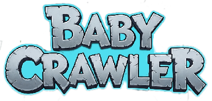

# Baby Crawler 🍼

A procedurally generated dungeon crawler where you play as a baby exploring an infinite nursery-themed dungeon!



## 🎮 Play the Game

- **Live Demo**: [Coming soon - Deploy to Netlify]
- **Netlify**: `https://your-site-name.netlify.app`

## 🎯 Game Features

- **Infinite Procedural Generation**: Explore endless dungeons that generate as you crawl
- **Nursery Theme**: Fight baby ghosts and slimes in a cute, baby-themed world
- **Inventory System**: Collect bottles for health and teddy bears to summon allies
- **Progressive Difficulty**: Monsters get stronger as you explore more area
- **Smooth Controls**: WASD or arrow keys for movement, 'I' for inventory

## 🛠️ Technology Stack

- **Game Engine**: Phaser 3
- **Language**: TypeScript
- **Build Tool**: Vite
- **Development**: DDEV (Docker-based)
- **Deployment**: Netlify

## 🚀 Getting Started

### Prerequisites
- Node.js (v18 or higher)
- npm or yarn
- DDEV (optional, for Docker development)

### Installation

1. Clone the repository:
```bash
git clone https://github.com/YOUR_USERNAME/baby-crawler.git
cd baby-crawler
```

2. Install dependencies:
```bash
npm install
```

3. Run the development server:
```bash
npm run dev
```

4. Open your browser to `http://localhost:5173`

### Using DDEV (Recommended)

```bash
ddev start
ddev exec npm install
ddev exec npm run dev -- --host
```

Then access at `https://baby-crawler.ddev.site:5174`

## 🎮 How to Play

- **Move**: Use WASD or Arrow keys
- **Inventory**: Press 'I' or click the drawer at the bottom
- **Use Items**: Click items in your inventory
- **Drop Items**: Right-click items in your inventory
- **Survive**: Avoid monsters or fight back with teddy bears!

## 📁 Project Structure

```
baby-crawler/
├── public/images/       # Game assets
│   ├── ui/             # UI elements
│   ├── sprites/        # Character sprites
│   └── items/          # Item images
├── src/
│   ├── entities/       # Game entities (Player, Monsters, Items)
│   ├── scenes/         # Phaser scenes
│   ├── utils/          # Utilities and configuration
│   └── world/          # World generation system
└── ...configuration files
```

## 🤝 Contributing

Contributions are welcome! Please feel free to submit a Pull Request.

## 📝 License

This project is open source and available under the [MIT License](LICENSE).

## 🎨 Assets

- Custom pixel art sprites created for this game
- UI elements designed with a nursery theme

---

Made with ❤️ and lots of baby giggles